Link to Frontend repo: [Harbe FE](https://github.com/AndrewNguyen-05/Harbe-FE)

# Harbe

### Contributors

- Nguyen Van Hoang Anh - 21520144@gm.uit.edu.vn - [Github](https://github.com/AndrewNguyen-05) - [Facebook](https://www.facebook.com/andrew.nguyen0505/)
- Hoang Duc Manh - 21520062@gm.uit.edu.vn - [Github](https://github.com/Marowota) - [Facebook](https://www.facebook.com/hoangducmanh254)

### Supervisors

- Nguyen Trinh Dong - dongnt@uit.edu.vn

### Description

- Harbe is an ecommerce system utilizing microservices architecture, using NextJS, ReactJS, TailwindCSS for frontend.
- I use SpringBoot to build services, Spring Cloud to build gateway, config server for microservices, Resilience4j to handle error, RabbitMQ to sync between services and Zipkin for tracing.
- The database I choose for this project is MySQL and Redis for cart service.
- You can see the report [here](https://drive.google.com/file/d/1MxEw0X9wGU1nWqVVXuw1AJ_YOFRNLfJf/view?usp=sharing)

  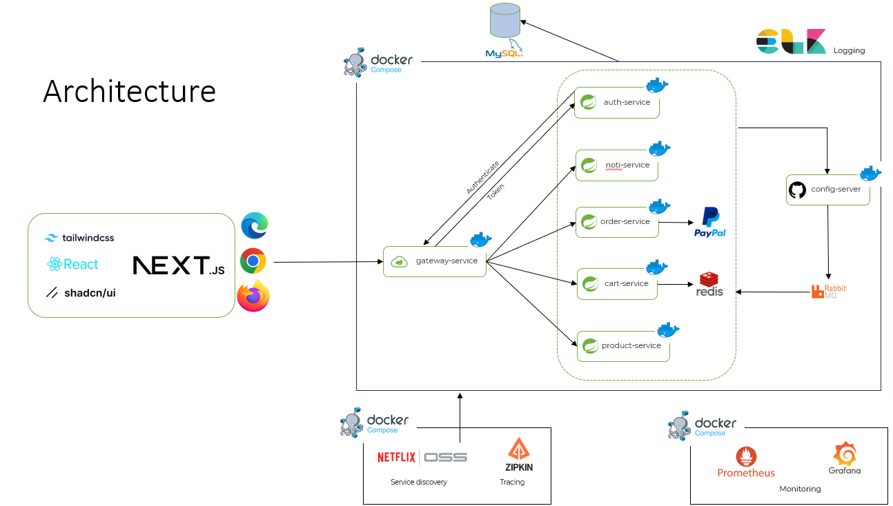
  
<i>Application Architecture</i>

- I implement a basic circuit breaker flow for demo.

  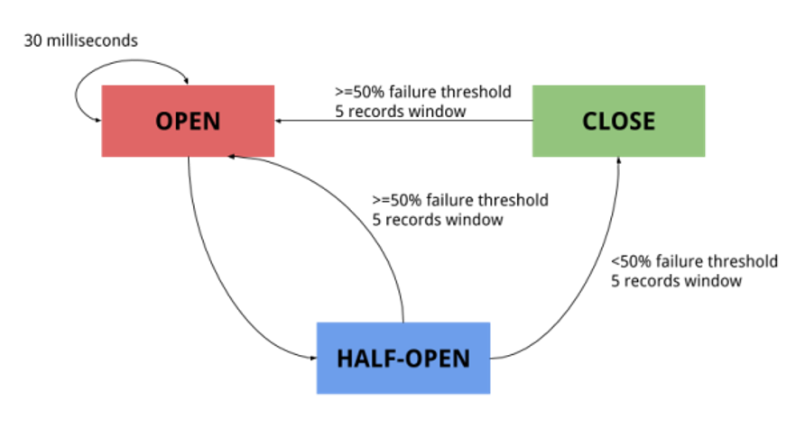
  
<i>Circuit Breaker</i>

- This is the general Usecase Diagram for this application

  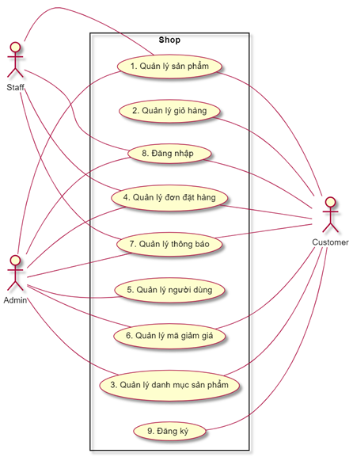
  
<i>General Usecase Diagram</i>

- My application also implements Grafana and Prometheus to monitor, this is the general flow of Grafana and Prometheus:

  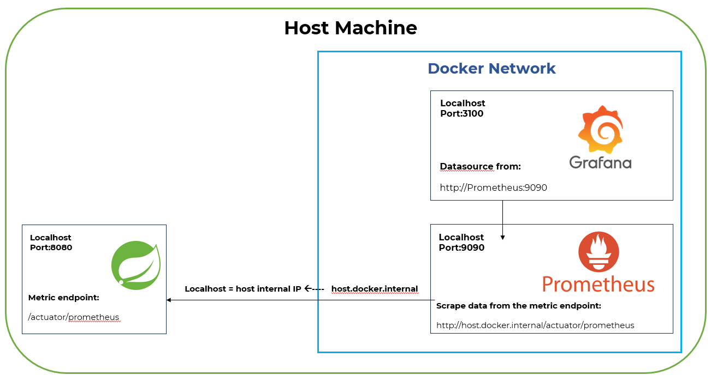
  
<i>Monitoring Flow</i>

### Technologies and Framework
- Back-end
  - Java 17
  - Spring Boot 3: Authorization Server (OAuth 2), Statemachine ...
  - Spring Cloud Gateway, Open Feign, Stream ...
  - Elastic stack: Elasticsearch, Logstash, Kibana, Filebeat
  - Grafana stack: Prometheus, Grafana
  - Zipkin
  - Redis
- Front-end
  - NextJS 14
  - ReactJS
  - TailwindCSS
  - RadixUI
  - ShadcnUI

### Demo
Some of the pictures of this Application
- Front-end:

  

  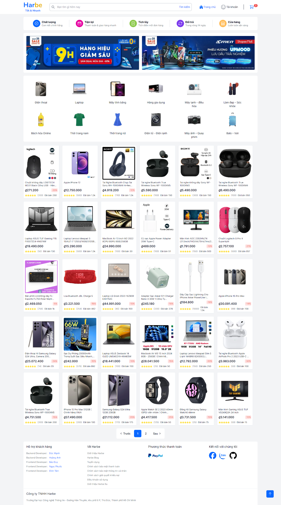
  
<i>Homepage Screen</i>

  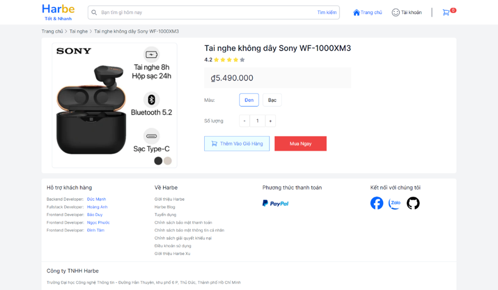
  
<i>Detail product Screen</i>

  
  
<i>Admin product Screen</i>

- Back-end:

  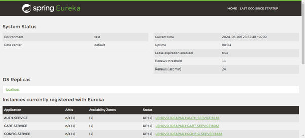
  
<i>Spring Netflix Eureka</i>

  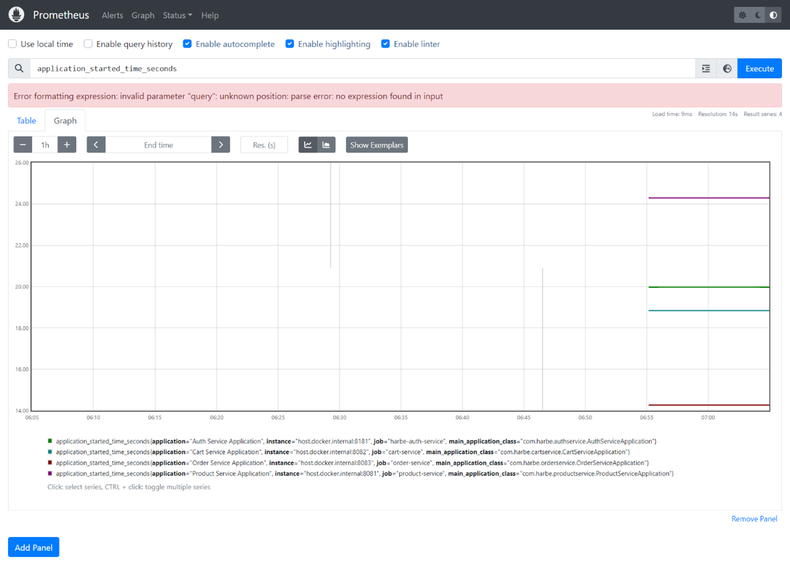
  
<i>Prometheus Screen</i>

  
  
<i>Grafana Screen</i>

  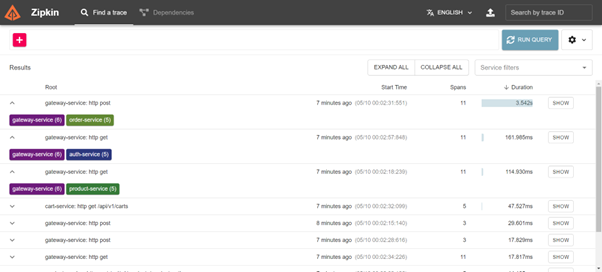
  
<i>Zipkin Screen</i>

  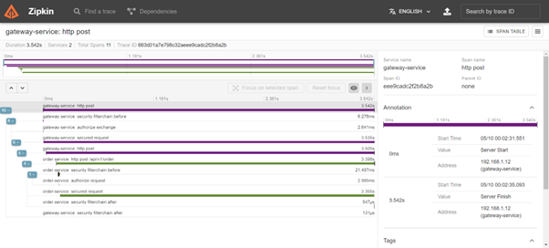
  
<i>Zipkin Detail Screen</i>

  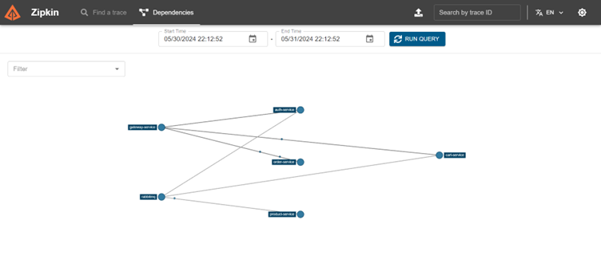
  
<i>Zipkin Graph Screen</i>

  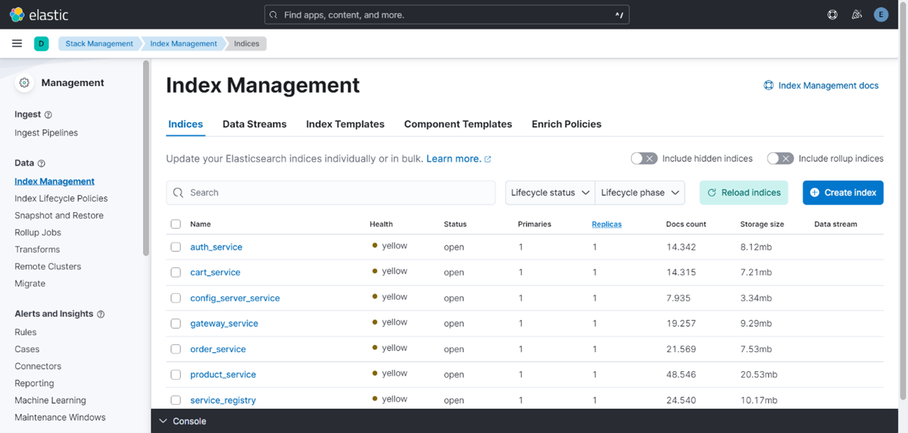
  
<i>ELK Stack Screen</i>

  
  
<i>ELK Stack Screen</i>

